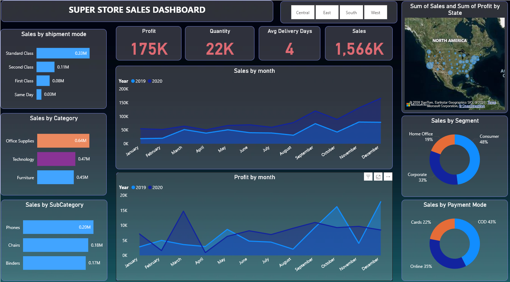
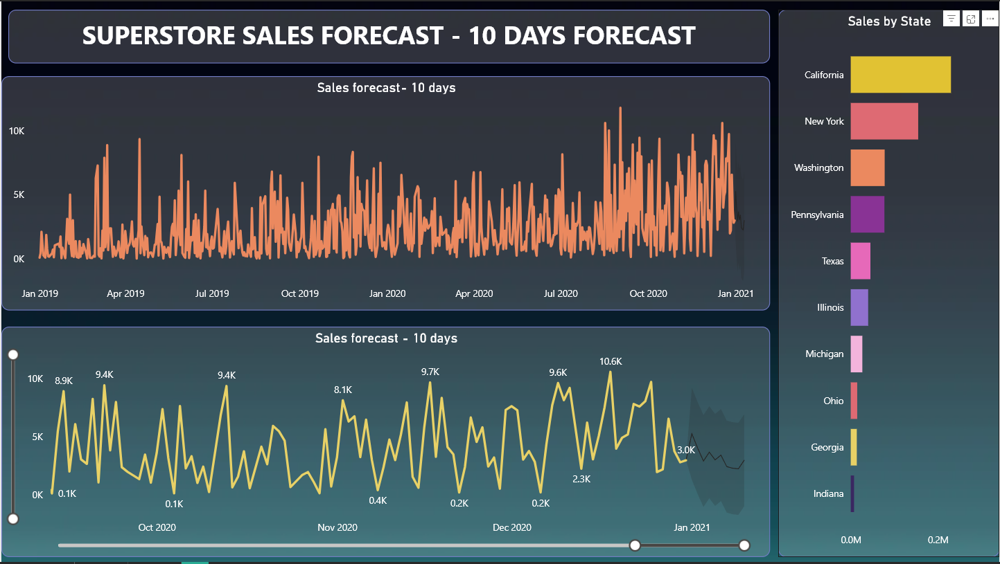

# Superstore Sales Dashboard (Power BI)

## Project Overview

This Power BI dashboard analyzes Superstore sales data to uncover key business insights such as revenue trends, profit performance, customer segments, and shipping behavior. The dashboard also includes a short-term sales forecast to estimate future sales trends.

## Objectives

* Analyze overall sales performance
* Identify top-performing states and product categories
* Understand customer purchasing patterns
* Track monthly sales and profit trends
* Forecast upcoming sales performance

## Dataset

The dataset contains Superstore retail sales information.

* **SuperStore Sales DataSet.xlsx** – Contains order details such as order date, sales, profit, quantity, category, and customer segment.
* **SuperStore_Sales_Dataset.csv** – Raw dataset used for data analysis and visualization.

Dataset files are available in the **Data/** folder.

## Dashboard Features

The dashboard provides insights into:

* Total Sales
* Total Profit
* Quantity Sold
* Average Delivery Days
* Sales by Category
* Sales by Sub-Category
* Sales by Shipment Mode
* Sales by State
* Sales by Customer Segment
* Monthly Sales Trends
* Monthly Profit Trends
* **10 Day Sales Forecast**

## Tools Used

* **Power BI**
* **Excel**
* **Data Modeling**
* **DAX**
* **Time Series Forecasting**

## Dashboard Preview

### Superstore Sales Dashboard



### Sales Forecast Dashboard



## Key Insights

* Consumer segment contributes the largest share of total sales.
* Office Supplies category generates the highest revenue among all categories.
* California and New York are among the top performing states.
* Standard Class is the most frequently used shipping mode.
* Sales trends show fluctuations across months indicating seasonal demand patterns.

## Repository Structure

```
Superstore-Sales-Dashboard
│
├── Data
│   ├── SuperStore Sales DataSet.xlsx
│   └── SuperStore_Sales_Dataset.csv
│
├── Images
│   ├── dark-color-background.jpg
│   ├── sales_forecast.png
│   └── superstore_dashboard.png
│
├── Super store sales and forecast.pbit
│
└── README.md
```
